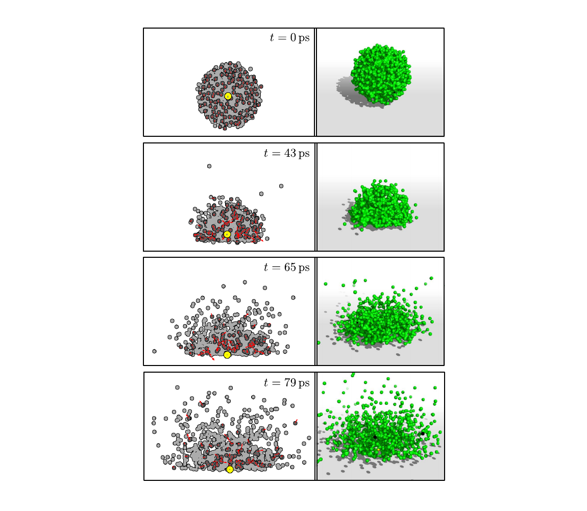

# ccdyn
ccdyn is a molecular dynamics program for performing classical trajectory simulations for gas-phase systems.

It includes different integrators:
1) velocity Verlet
2) Beeman
3) Beeman predictor-corrector
4) Beeman predictor-corrector with the second order Adams–Moulton method for velocities update.

At this moment only the Berendsen thermostat is implemented.

ccdyn only supports pair potentials. The following set of parameters are available:

1) Ar-Ar [[H.L. Davis et al., *J. Chem. Phys.* **86**, 6456 (1987)](https://aip.scitation.org/doi/abs/10.1063/1.452436)]
2) Au-Au [[I. León et al., *J. Chem. Phys.* **139**, 194306 (2013)](https://aip.scitation.org/doi/abs/10.1063/1.4830408)]
3) He-TiO<sub>2</sub> [[N.F. Aguirre et al., *J. Chem. Phys.* **136**, 124703 (2012)](https://aip.scitation.org/doi/abs/10.1063/1.3698173)]
4) Au-TiO<sub>2</sub> [[M.P. de Lara-Castells et al., *J. Chem. Phys.* **142**, 131101 (2015)](https://aip.scitation.org/doi/abs/10.1063/1.3698173)]
5) He-Au [[X.-F. Tong et al., *J. Chem. Phys.* **131**, 244304 (2009)](https://aip.scitation.org/doi/abs/10.1063/1.3274815)]
6) He-He [[R.A. Aziz, and M.J. Slaman, *J. Chem. Phys.* **94**, 8047 (1991)](https://aip.scitation.org/doi/abs/10.1063/1.460139)]
7) He-Mg [[R.J. Hinde, *J. Phys. B. 131*, **244304** (2009)](http://iopscience.iop.org/article/10.1088/0953-4075/36/14/313)]
8) Mg-Mg [[S. Kotochigova and P. Julienne](https://www.nist.gov/pml/potential-energy-surface-database-group-ii-dimer-molecules)]
9) Ni-Ni [[V.P. Filippova et al., *Inorganic Materials: Applied Research*](https://link.springer.com/article/10.1134/S2075113315010062)]
10) Ni-O [[S.P. Walch and W.A. Goddard, *J. Am. Chem. Soc.* **100**, 1338 (1978)](https://link.springer.com/article/10.1134/S2075113315010062)]

## Authors

* Nestor F. Aguirre ( nfaguirrec@gmail.com )
* Maria P. de Lara-Castells ( pilar.delara.castells@csic.es )

# Citing

To cite the code, please proceed as follows:

[](https://zenodo.org/badge/latestdoi/117065059)

The following is an example of an input file:

```
&system
     nAtoms = 1001
     initialDensity = "density.N1000.dat"
     actions = "STFEPFS"
/

&thermalize
     nSteps = 1000, 500
     timeStep = 0.05, 0.01
     temperature = 0.1
     tau = 10.0
     showFrequency = 500
     geometryHistoryFile = "salida.xyz"
     integrator = "VelocityVerlet"
/

&freeEvolution
     nSteps = 1000, 1000
     timeStep = 0.02, 0.01
     showFrequency = 500
     geometryHistoryFile = "salida.xyz"
     integrator = "BeemanPredCorr"
/

&push
     velocity = 0.0, 0.0, -2.0
/

&potential
     pair = He:He, Au:He
     function = HeHe_AzizSlaman, AuHe_Tong2009
/

&externalField
     atom = He, Au
     function = HeTiO2_M3DP, AuTiO2_SM2D
     shift = 0.0,0.0,-25.0,  0.0,0.0,-25.0
/
```

In this example, a droplet doped with a gold atom is created from a density file. Then the droplet is thermalized, freely evolved and finally is pushed to collide against to a TiO2 surface. The graphical representation of the simulation is shown in the following figure:


